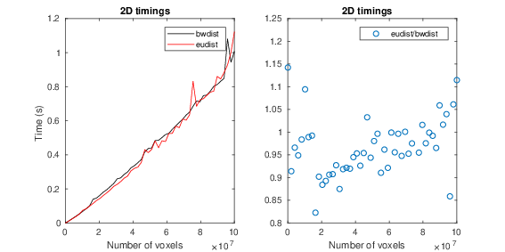
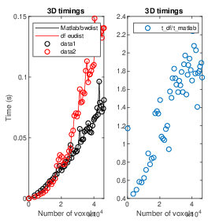

# edt

Euclidean distance transform.

Using the algorithm descirbed by Meijster et al. Mishchenko claims that their Matlab code for extending `eudist` in MATLAB from 2D to 3D is even faster than this. Is that possible?

 * `bwdist` in MATLAB uses all physical cores. On Intel 6700k, 4 threads are used. 1000 problems of size 1024x1024 took 12.4 s for the c code, 3.6 s for MATLAB, i.e., about the same time consumption in terms for TIMExTHREADS.

## Timings

For a `1042x1024x60` image, using dx=dy != dz for `df_eudist` and `bwdistsc`
```
bwdist*: 0.766235
df_eudist: 1.069094
bwdistsc 5.282077
```
* isotropic voxels with `bwdist`.




 * 3D timings suggests that there are some memory issues to be sorted out.
 * Note that `df_eudist` does not have the special case where the voxel size is `1 x 1 x 1`.

## TODO
 * Write tests for corner cases and for invalid input, then handle those cases.
 * Parallelize with `lpthread` in order to reduce the buffer sizes or look into how to do it with [openmp](https://computing.llnl.gov/tutorials/openMP/#Clauses), *private*, etc, ...
 * Split pass 1 and 2 in order to avoid cache misses (i.e., avoid turning direction too often).
 * Possibly also split pass 3 and 4.

## References:
 * Mishchenko, 2012.
 * Meijster et al., 2000.
