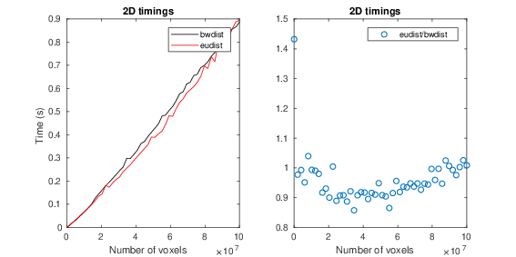
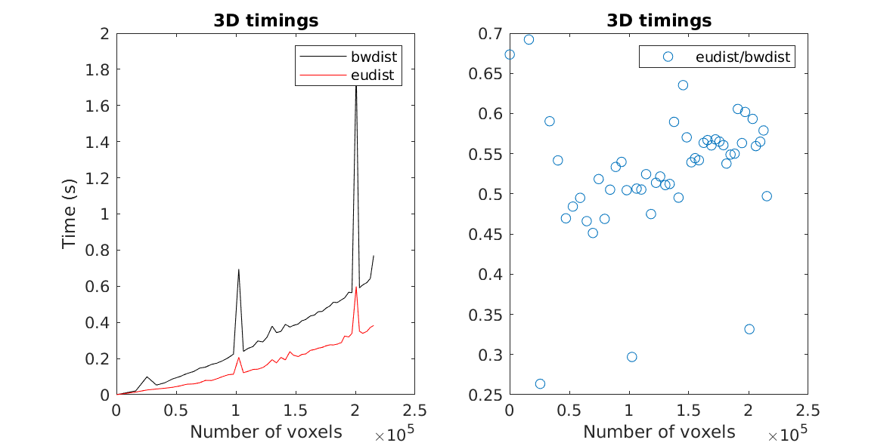

This repo contains an implementation of the Euclidean Distance
Transform (EDT) based on the work by Meijster et. al [^1] with
wrappers for MATLAB and Python.

The Euclidean distance transform, D, of a binary image, B, sets each
voxel in D to the shortest distance to any non-zero voxel in B. If the
voxel is considered to have the same length in each dimension it is
called *isotropic*, otherwise *anisotropic*. The computational
burden increases quadratically with the number of pixels in the obvious,
brute-force implementation. State of the art methods are linear in the
number of pixels and the number of dimensions, i.e., they are O(dN).

This repo contains an implementation of the Euclidean distance
transform for 2D and 3D images together with wrappers for MATLAB and
Python.

## Implementation
Differences to [^1]

* Also 3D, however not nD :(
* Also handles anisotropic voxels.
* Only the Euclidean distance transform, not the other alternatives
  that are discussed in the paper.
* `lpthread` is used for parallelisation and hence the code should
  compile on both Linux and Mac.
* In the description of pass 2 and 3 on page ?, line ?, '<' is replaced by
'<='.

## Timings

For a `1042x1024x60` image with isotropic pixels, on an AMD RYZEN
3700X

| Method                 | Time [s] | Note            |
| -------                | -------- | -----           |
| eudist                 |  0.7     | This            |
| bwdist                 |  1.0     | MATLAB [^4]     |
| bwdistsc               |  5.0     | For MATLAB [^2] |
| distance_transform_edt |  5.4     | SciPy [^3]      |

## TODO
* Write tests for corner cases and for invalid input.
* ND image implementation?
* Especially the Python wrapper needs some attention.
* The scheduling of the threads could for sure be optimized to handle
more exotic cases better.
* Switch to OMP to save some lines.
* Redo the documentation.
* Make a proper wheel or similar for Python

## References:
[^1]: Meijster, A., Roerdink, J.B.T.M., Hesselink, W.H. (2002). A
    General Algorithm for Computing Distance Transforms in Linear
    Time. In: Goutsias, J., Vincent, L., Bloomberg, D.S. (eds)
    Mathematical Morphology and its Applications to Image and Signal
    Processing. Computational Imaging and Vision, vol 18. Springer,
    Boston,
    MA. [DOI:10.1007/0-306-47025-X_36](https://doi.org/10.1007/0-306-47025-X_36)
[^2]: Mishchenko Y. (2013) A function for fastcomputation of large %
 discrete Euclidean distance transforms in three or more
 dimensions in Matlab. Signal, Image and Video Processing
 [DOI:10.1007/s11760-012-0419-9](http://doi.org/10.1007/s11760-012-0419-9)
 Downloaded from [https://se.mathworks.com/matlabcentral/fileexchange/15455-3d-euclidean-distance-transform-for-variable-data-aspect-ratio]

[^3]: [https://docs.scipy.org/doc/scipy/reference/generated/scipy.ndimage.distance_transform_edt.html]

[^4] [https://se.mathworks.com/help/images/ref/bwdist.html]
