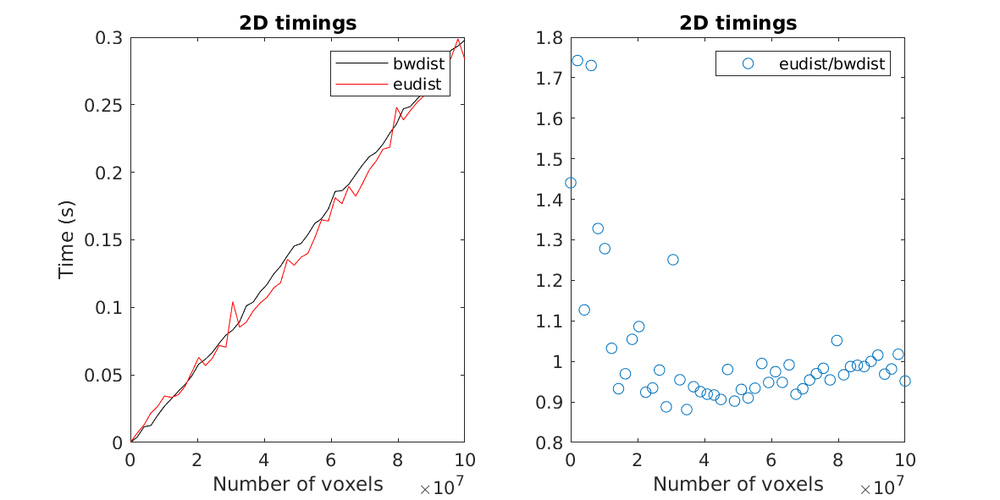

This repo contains an implementation of the Euclidean Distance
Transform (EDT) based on the work by Meijster et. al [^1] with
wrappers for MATLAB and Python.

Main points:
 - Competitive performance
 - Handles anisotropic pixel sizes at no extra cost.

The Euclidean distance transform, $`D`$, of a binary image, $`B`$,
sets each voxel in $`D`$ to the shortest distance to any non-zero
voxel in $`B`$. If the voxel is considered to have the same length in
each dimension it is called *isotropic*, otherwise *anisotropic*. The
computational burden increases quadratically with the number of pixels
in the obvious, brute-force implementation. State of the art methods
are linear in the number of pixels and the number of dimensions, i.e.,
they are $`\mathcal{O}(dN)`$.

## Implementation
Differences to [^1]

* Extended to 3D (however not nD).
* Handles anisotropic voxels. Basically this modification just
  required insertion of the pixel sizes at the proper places. The
  $`\mbox{Sep}`$ function looks different and in some places equality tests
  are replaced by greater/smaller or equal.
* Only the Euclidean distance transform is implemented, not the other
  alternatives that are discussed in the paper.

## Timings

For a $`1042\times1024\times60`$ image with isotropic pixels, on an
AMD Ryzen 3700X:

| Method                 | Time [s] | Note              |
| ----                   | ----     | -----             |
| eudist                 |  0.6     | This [^1]         |
| bwdist                 |  1.0     | MATLAB [^4]       |
| bwdistsc               |  5.0     | On MATLAB FX [^2] |
| distance_transform_edt |  5.4     | SciPy [^3]        |

## TODO
* Write tests for corner cases and for invalid input.
* ND image implementation?
* The Python wrapper needs attention.

## References:
[^1]: Meijster, A., Roerdink, J.B.T.M., Hesselink, W.H. (2002). A
    General Algorithm for Computing Distance Transforms in Linear
    Time. In: Goutsias, J., Vincent, L., Bloomberg, D.S. (eds)
    Mathematical Morphology and its Applications to Image and Signal
    Processing. Computational Imaging and Vision, vol 18. Springer,
    Boston,
    MA. [DOI:10.1007/0-306-47025-X_36](https://doi.org/10.1007/0-306-47025-X_36)
[^2]: Mishchenko Y. (2013) A function for fastcomputation of large %
 discrete Euclidean distance transforms in three or more
 dimensions in Matlab. Signal, Image and Video Processing
 [DOI:10.1007/s11760-012-0419-9](http://doi.org/10.1007/s11760-012-0419-9)
 Downloaded from [https://se.mathworks.com/matlabcentral/fileexchange/15455-3d-euclidean-distance-transform-for-variable-data-aspect-ratio]

[^3]: [https://docs.scipy.org/doc/scipy/reference/generated/scipy.ndimage.distance_transform_edt.html]

[^4]: [https://se.mathworks.com/help/images/ref/bwdist.html]
